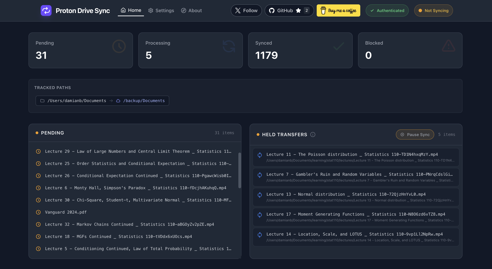

# Proton Drive Sync

Sync local directories to Proton Drive. Runs as a background service with a web dashboard, automatically uploading changes as they happen.



## Getting Started

### Requirements

- macOS (Linux/Windows not yet supported — [open an issue](https://github.com/damianb-bitflipper/proton-drive-sync/issues) to register interest)
- [Homebrew](https://brew.sh)

### Installation

```bash
curl -fsSL https://www.damianb.dev/proton-drive-sync/install.sh | bash
```

### Authentication

```bash
proton-drive-sync auth
```

### Set Up Service (Recommended but Optional)

Install Watchman and proton-drive-sync as launchd services that start automatically on login. The installer prompts you to choose which services to install (accept both unless you have already installed Watchman as a service before).

```bash
# Install the service
proton-drive-sync service install
```

### Configuration

Run the config command to create and edit your config file:

```bash
proton-drive-sync config
```

This opens the config file at `~/.config/proton-drive-sync/config.json`:

```json
{
  "sync_dirs": [
    {
      "source_path": "/path/to/directory",
      "remote_root": "/backups"
    }
  ]
}
```

| Field                     | Required | Description                                         |
| ------------------------- | -------- | --------------------------------------------------- |
| `sync_dirs`               | Yes      | Array of sync directory configurations              |
| `sync_dirs[].source_path` | Yes      | Local directory path to sync                        |
| `sync_dirs[].remote_root` | No       | Remote folder prefix in Proton Drive (default: "/") |

Each directory in `sync_dirs` will be watched and synced to Proton Drive. Files are uploaded to a folder named after the directory basename (e.g., `source_path: "/Users/me/Documents"` syncs to `/Documents` in Proton Drive, or `/backups/Documents` if `remote_root` is set to `/backups`).

## Other CLI Usage

Apart from running as a service, this tool can be used as a CLI program:

```bash
# Show help
proton-drive-sync --help

# One-time sync
proton-drive-sync sync

# Watch for changes continuously (Ctrl+C to stop)
proton-drive-sync sync --watch

# Verbose output
proton-drive-sync sync -v

# Dry run (show what would sync without making changes)
proton-drive-sync sync --dry-run

# Uninstall the service
proton-drive-sync service uninstall
```

## Development

See [DEVELOPMENT.md](DEVELOPMENT.md) for development setup and contributing guidelines.
